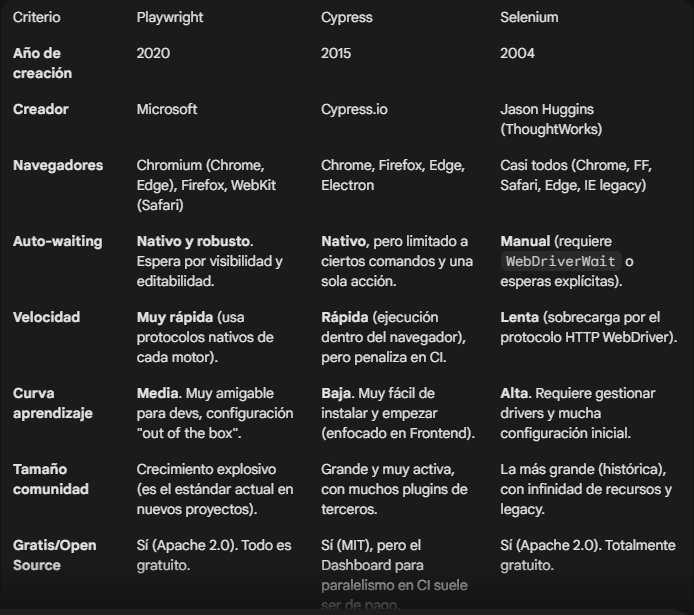

# Research: UI Testing Framework

**Fecha:** 2025-02-07  
**Investigador:** Diego de Juan

## 🎯 Objetivo

Elegir el framework de UI testing más adecuado para el proyecto qa-ecommerce-showcase.

---

## 📋 Requisitos del Proyecto

- App web e-commerce moderna
- Cross-browser: Chrome, Firefox, Safari
- Ejecución headless para CI/CD
- Screenshots/videos en fallos
- Paralelización
- TypeScript como lenguaje
- Comunidad activa

---

## 🔍 Opciones Evaluadas

### Playwright

**¿Qué es?**
Permite prueba E2E para aplicaciones web modernas.

**Navegadores soportados:**
Chrome, Firefox, Edge y Safari.

**TypeScript support:**
Sí

**Pros:**
Compatible con todos los navegadores. Playwright es compatible con todos los motores de renderizado modernos, como Chromium, WebKit y Firefox.

Multiplataforma. Prueba en Windows, Linux y macOS, localmente o en CI, con o sin interfaz gráfica.

Compatible con varios lenguajes. Utiliza la API de Playwright en TypeScript , JavaScript , Python , .NET y Java .

Prueba la Web Móvil. Emulación móvil nativa de Google Chrome para Android y Safari Móvil. El mismo motor de renderizado funciona en tu ordenador y en la nube.

**Contras:**
- Curva de aprendizaje más pronunciada, pero capacidades avanzadas
- 
- 

**Casos de uso ideales:**
E2E web

---

### Cypress

**¿Qué es?**
Escribe, ejecuta y depura como un profesional

**Navegadores soportados:**
Chrome, Firefox, Edge y Safari.

**TypeScript support:**
Sí

**Pros:**
- Rapidez
- Herramienta incorporada para encontrar errores
- 

**Contras:**
- Complejidad de integración con otras herramientas
- Poca compatibilidad con lenguajes de programación
- 

**Casos de uso ideales:**
E2E web

---

### Selenium WebDriver

**¿Qué es?**
Framework de automatiación de plaicaciones web

**Navegadores soportados:**
Google Chrome, Mozilla Firefox, Safari, Microsoft Edge y, de forma limitada, Internet Explorer

**TypeScript support:**
No, pero sí JS

**Pros:**
- Flexibilidad e integración
- Versatilidad con lenguajes de programación
- 

**Contras:**
- Configuración algo complicada al principio
- Velocidad lenta de ejecución
- 

**Casos de uso ideales:**
Pruebas funcionales y de regresión complejas en aplicaciones web heredadas (legacy) o de gran escala que requieren compatibilidad con múltiples navegadores y lenguajes de programación. 

---

## 📊 Comparativa Rápida

---

## 🌐 Fuentes Consultadas

- https://www.selenium.dev/
- https://www.cypress.io/#create
- https://playwright.dev/
- [Link 4]

---

## 💭 Mis Notas Personales

Me parece importante que Selenium tenga bastantes configuraciones y que sea más lento que los demás

---

## 🤔 Primera Impresión

**Opción que me inclino instintivamente:** Playwrigth o Cypress, ambos utilizan TypeScript. Cypress.

**Por qué:**  Playwrigth lo conozco, Cypress no, quizá sea bueno aprender uno nuevo y comparar. Además según la teoría, es más rápido y sencillo.

**Dudas que aún tengo:** ¿Mejorar con Playwright o aprender Cypress?